# WAPH-Web Application Programming and Hacking

## Instructor: Dr. Phu Phung

## Student

**Name**: Srujana Vadagandla

**Email**: vadagasy@mail.uc.edu

{width=150px height=150px}

# Lab 1 - Foundations of the Web

## Overview : 
This lab delves deeper into front-end web application development. As part of Lab 1, I learned how to use TELNET to analyze network packets using a wireshark program based on HTTP requests and responses and compare them with requests sent by browsers.
I completed hands-on practice with CGI applications in HTML and C within Part 2 of Lab 1. In addition, this lab covered the construction of PHP web applications. learned how to use curl and the wireshark tool to become acquainted with HTTP GET and POST requests in part 3. The pandoc program was used to create the PDF file after all relevant screenshots had been taken and added, and the content had been prepared in markdown.


[https://github.com/vadagasy/waph-vadagasy/blob/main/labs/lab1/README.md](https://github.com/vadagasy/waph-vadagasy/blob/main/labs/lab1/README.md)


## Part 1 : The WEB and the HTTP Protocol

### Task 1. Familiar with the Wireshark tool and HTTP protocol

Network packet analysis is the focus of the Wireshark utility. I loaded and launched the application to capture packets in order to become acquainted with this program. I initially set the filter option to any to record all packets. After that, I started using the search box to enter HTTP in order to capture packets and filter data.

The hostname, source, destination, ports, and HTTP version are all included in the HTTP request. and the identical source and destination IP addresses, ports, content type, and status code are all included in the answer.
By clicking on the response and moving to the follow http stream, the HTTP format was also recorded.


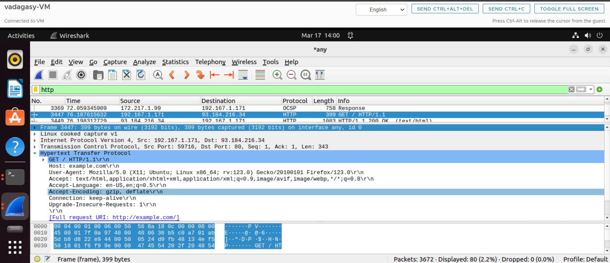


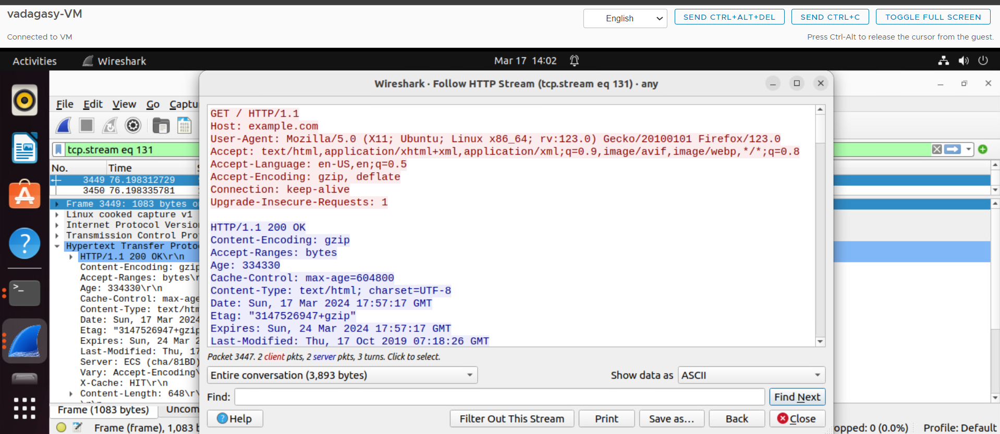

### Task 2. Understanding HTTP using telnet and Wireshark
We started Wireshark to capture the network packets before issuing an HTTP request via TELNET over the console to example.com or index.html. To use TELNET, first a connection was established to the example.com web server. Applying the portNumber syntax from example.com on telnet. After the connection was established, the type of request, path file, http version, and host name were supplied for sending the HTTP request. And the response was obtained after hitting Enter twice.

When comparing the HTTP queries sent through the browser with TELNET in Wireshark, it is seen that the telnet request was lacking server information. The telnet HTTP request is made manually, in contrast to the browser, which automatically fills in request headers such user-agent, accept, accept-language, authorization, etc.


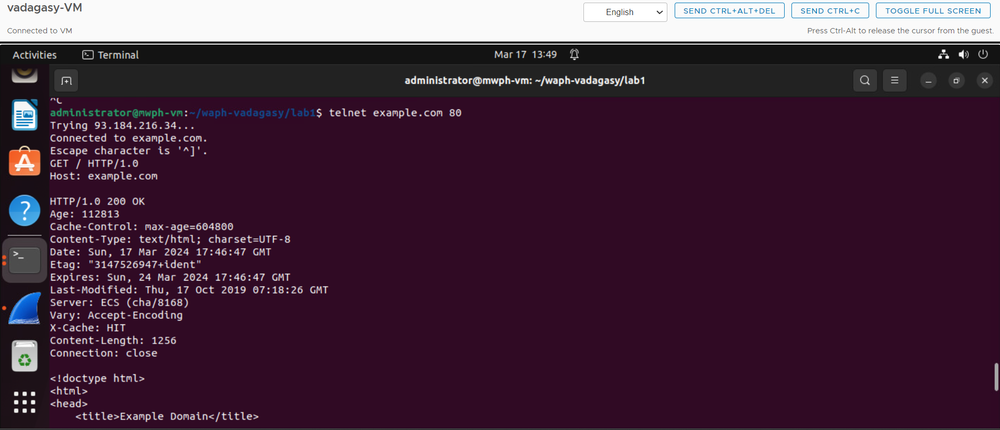

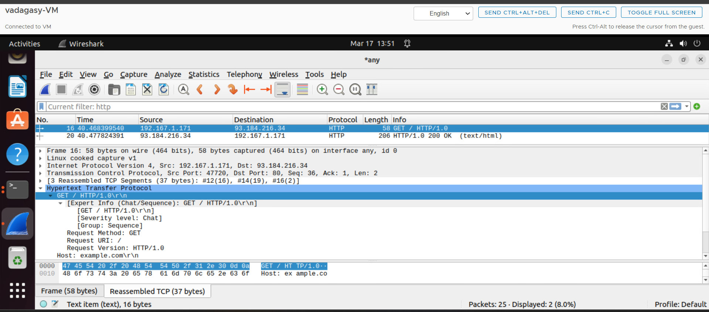

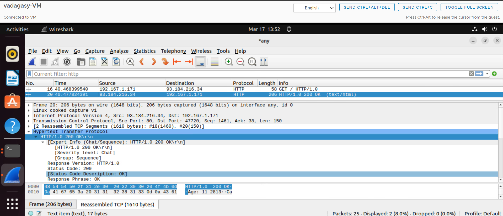

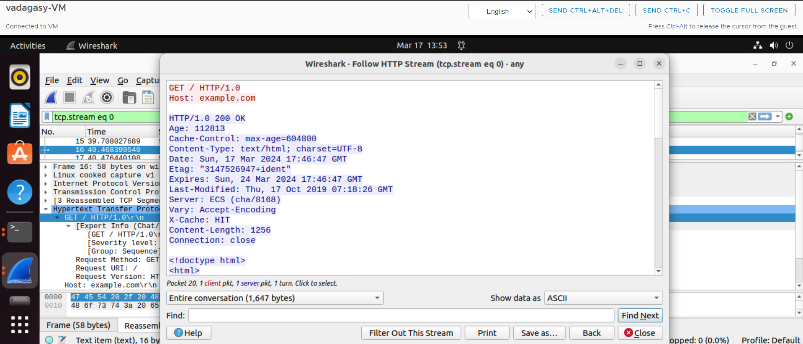

## Part II - Basic Web Application Programming

### Task 1: CGI Web applications in C

a. Using CGI I've created a C program that prints the following message: "Hello World CGI! Regards, Srujana, WAPH." Subl has been used to write this sentence in C. GCC was then installed in order to compile the.c program. The.cgi file has been copied to the path /usr/lib/cgi-bin once the program has been executed. I entered the localhost and the name of the.cgi file in the browser to access it, and the output appeared as follows:


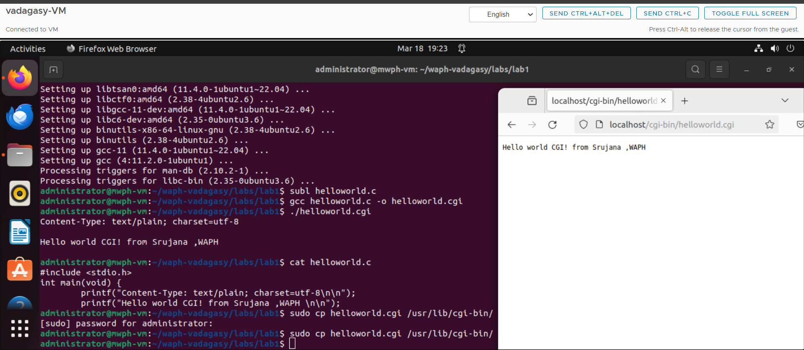

b. To continue, As part of my homework, I created a C program that included HTML information. The student's name is in the heading part and some other information is in the paragraph section. Initially, I copied the helloworld.c file to the index.c file. I used GCC to compile the code and execute the application in a similar manner. After that, the.cgi file was moved to the /usr/lib/cgi-bin directory.I entered the localhost and the name of the index.cgi file in the browser to access it, and the output was shown as follows.


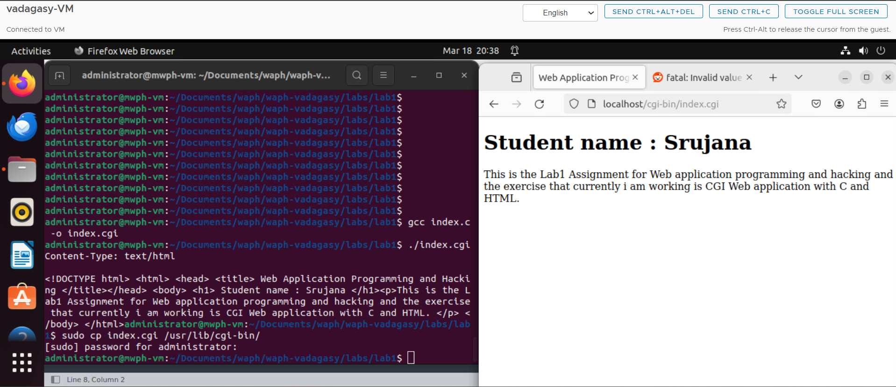

Included file `helloworld.c`:
```C
    #include<stdio.h>
    int main() {
    const char *htmlContent = "<!DOCTYPE html> <html> <head> <title>Web Application 
                              Programming and Hacking</title>"
                              "</head> <body> <h1>Student: Srujana</h1>"
                              "<p>This exercise is done as part of Lab1 
                              assessment i.e CGI Web Applications with C.
                              </p></body></html>";

    printf("Content-Type: text/html\n\n");
    printf("%s", htmlContent);
    return 0;
}
```

### Task 2: A Simple PHP Web application with User input

a. PHP is a programming language used to create server-side web applications. I have developed a straightforward PHP web application that accepts user input as part of assignment 2. I installed PHP and set it up with ApacheServer for that. Subsequently, I used subl to construct helloworld.php. Helloworld and my name, Srujana, are included in the sample code that I used.After copying it to /var/www/html, it was deployed by utilizing the localhost address and the.php file name to check in a browser.


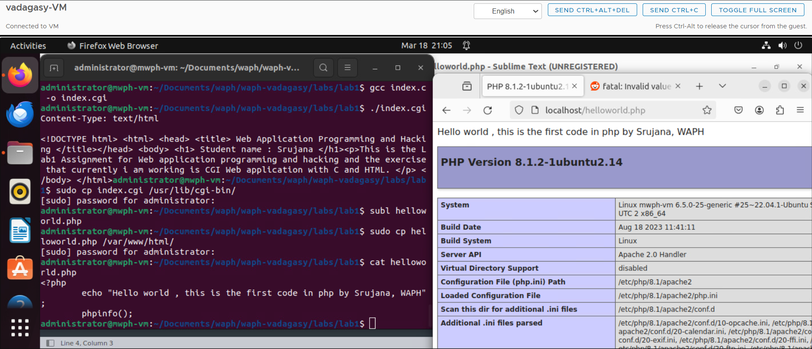

Included file `helloworld.php`:
```PHP
<?php
    echo "Hello World! This is my first PHP program, Srujana , WAPH";
?>
```

b. As part of homework, a PHP echo web application has been developed to output the path variable that was sent along with the http request. Copying the.php file to the directory /var/www/html allows PHP to use $_REQUEST('data') to capture the path variables in GET and POST requests.I entered the filename, the localhost IP address, and a? with the user input (name) in the browser.Confidentiality-related security risks, such as data manipulation, SQL injections, and remote code execution. By completing input validation, preparing statements for SQL inputs, and cleaning user inputs, these risks can be minimized.


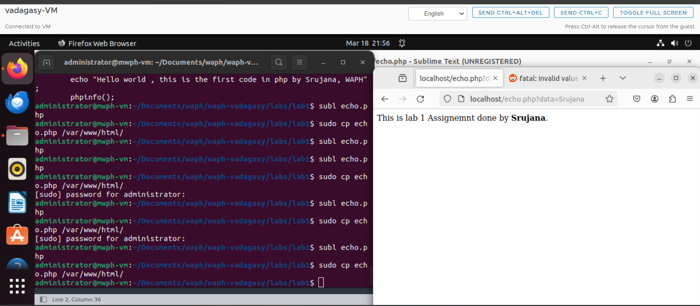

Included file `echo.php`:
```PHP
<?php
    $inputData = $_REQUEST["data"];
    echo "The input from the request is <strong>" . $inputData . "</strong>.<br>";
?>
```

### Task 3: Understanding the HTTP GET and POST Requests
a. I've now grasped the fundamentals of GET and POST requests and have used Wireshark to analyze packets using GET and POST calls.
Initially, an HTTP GET request was made, and IPaddress/echo.php?data="value" was used to supply the path variable.
Instead of value, the user might supply personalized information. I've included my name as a value in the example. Following that, the stream packets for the HTTP request and HTTP response were recorded and examined. The screenshots are attached below.


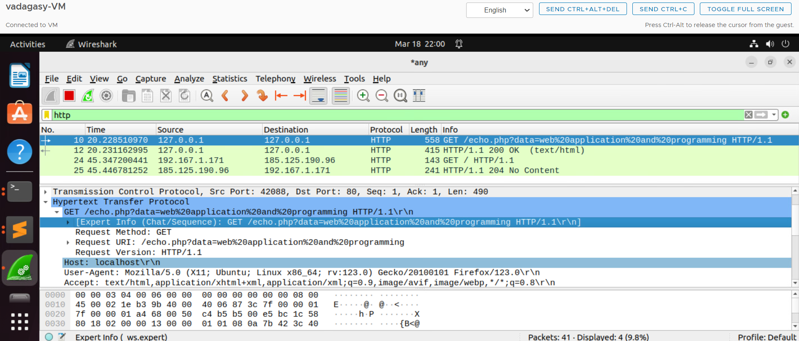

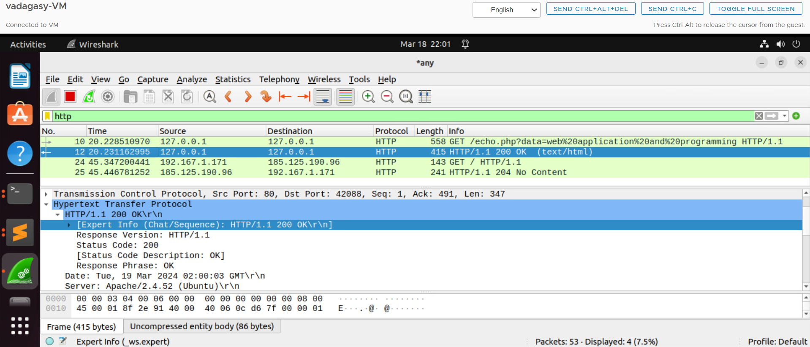

b. Data is processed using many network protocols by a command-line application named Client URL of Curl. Through the terminal, I have sent a post request to echo.php with CURL.


curl -X POST localhost/echo.php -d "data=Srujana"

Here the network packets were analyzed and the HTTP stream was captured.

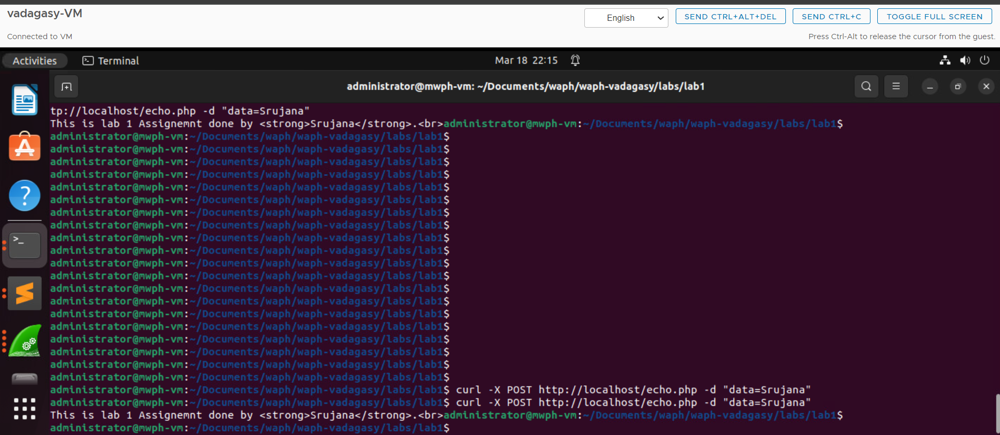


c.The GET and POST methods are similar in that
1. Both are utilized for file uploads and data transfers between the client and server.
2. The HTTP protocol is the same for both.
3. Both approaches include request parameters.
4. GET and POST requests can be sent over HTTPS.

Differences
1. Since the data is visible in the URL, GET is not safe.
2. Whereas the URL is used for GET requests, the request body is used for POST requests.
3. POST Url cannot be bookmarked, but GET Url can.
The responses from the HTTP GET and HTTP POST queries are identical because the echo.php website is a copy of the application and only prints the input it gets.


