# WAPH-Web Application Programming and Hacking

## Instructor: Dr. Phu Phung

## Student

**Name**: Srujana Vadagandla

**Email**: vadagasy@mail.uc.edu

{width=150px height=150px}

# Lab 2 - Front-end Web Development

## Overview : 
This lab explores the construction of front-end web applications in further detail. In relation to Lab 2, I learned how to make a web application by incorporating images and forms with a few simple HTML tags and JavaScript. I also made an HTTP GET and POST request and used the inspect element to further evaluate the request, response, and status code. Subsequently, Jquery, CSS, and Ajax were utilized to improve the online application and simplify the code. After all pertinent screenshots were captured and included, and the material was produced in markdown, the pandoc tool was used to build the PDF file.

[https://github.com/challans216/waph-challans/blob/main/lab/lab2/README.md](https://github.com/challans216/waph-challans/blob/main/lab/lab2/README.md)

## Task 1 : Basic HTML with forms, and JavaScript

### a. HTML

The code for the straightforward http form in the following image reroutes the echo.php file that we produced in the previous lab upon submission.

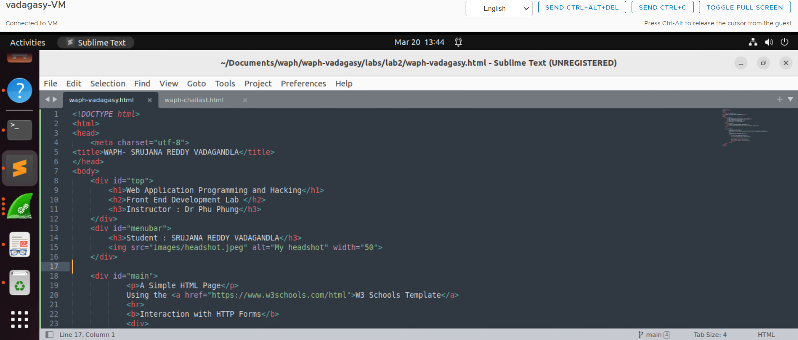

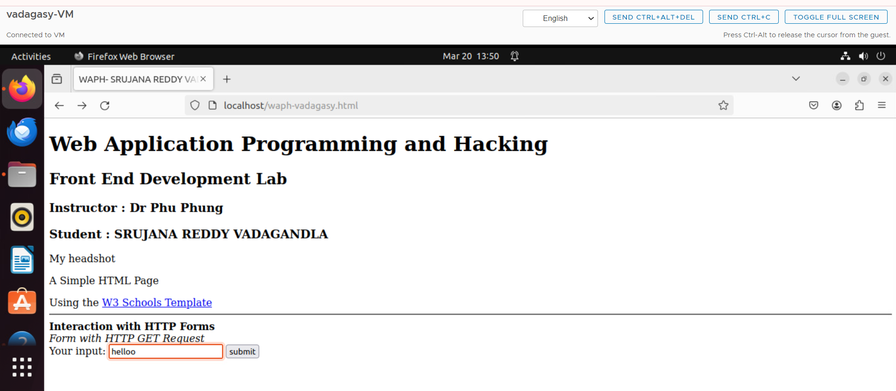

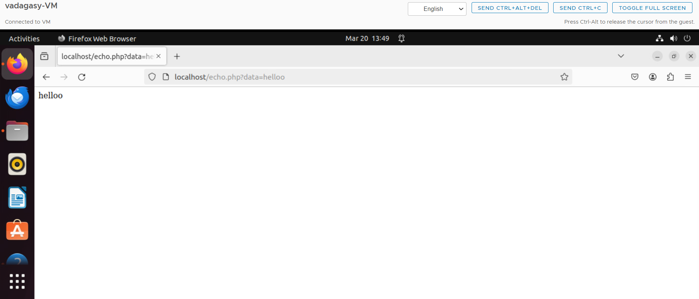

### b. JavaScript
The code we wrote for inline JS to log a message to the console upon a text input's keypress event is shown in the following image.

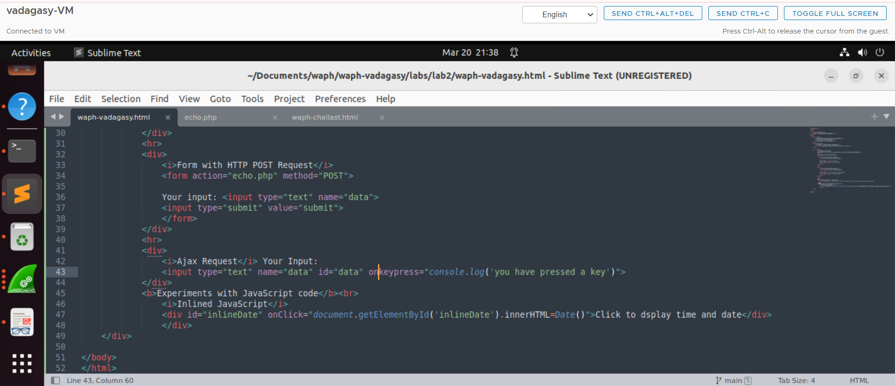

The above code is implemented and is shown as below

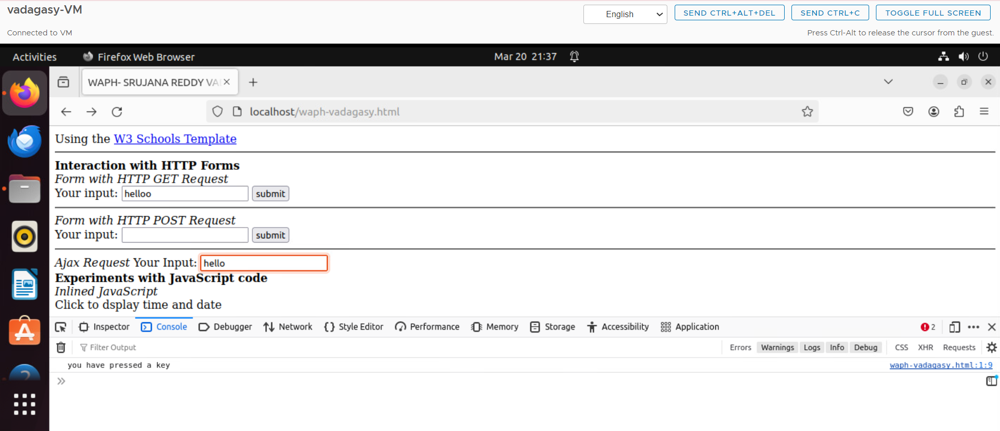

The below image shows inline js that has been written to show date on mouse click

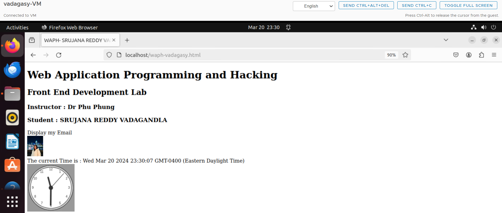

The below image displays the code for analog and the digital clock

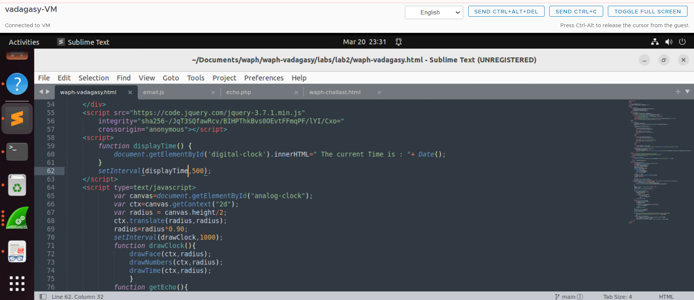

The output of the above code is displayed as below

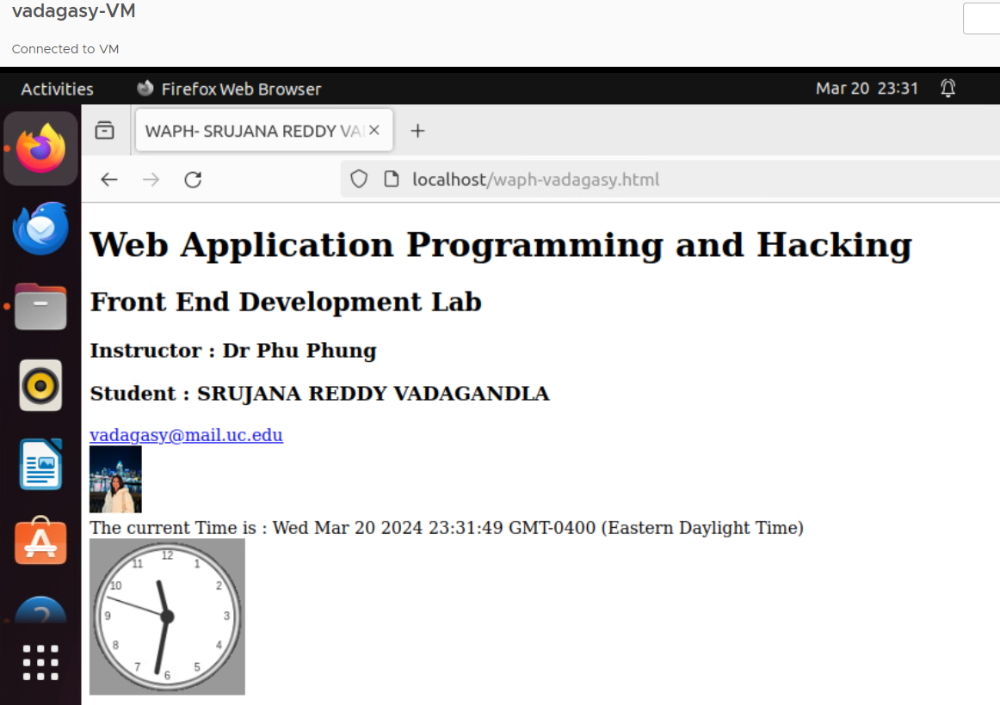

## Task II -  Ajax, CSS, jQuery, and Web API integration

### a: Ajax

After learning JavaScript and HTML, I began utilizing AJAX. AJAX allows us to retrieve data and communicate with the server without waiting. To do this, it makes use of the XMLHTTPRequest Object. This implies I may alter the content on our website without having to reload the entire page. I accomplished this by utilizing a custom input box and a button to request information from a file called echo.php, which I created in our first lab. Then I examined the responses by inspecting a section of the browser. 
Here are some images of what happened when I used AJAX to request this information.

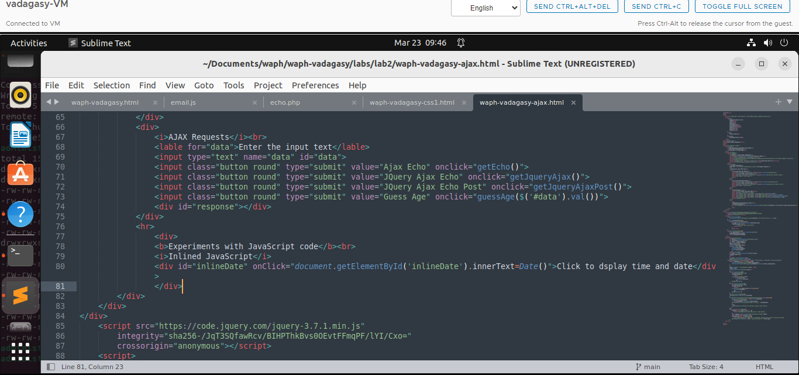
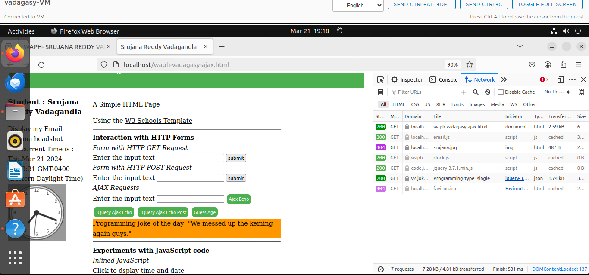

### b. CSS 

In this section 2b, I focused on making the website seem better. First, I created a simple example to demonstrate how to alter the background color using inline CSS. Later, I added more styles to the homepage using the "<style>" element in the head section.

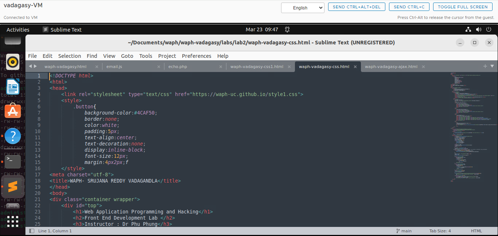
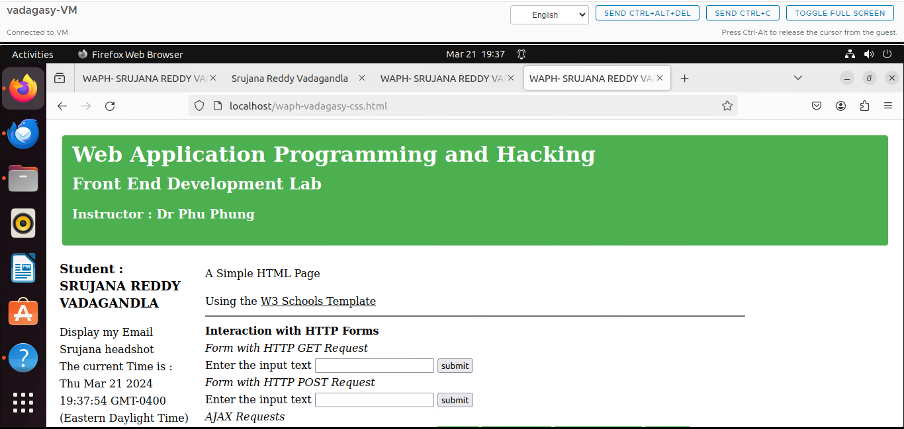

### c: JQuery

I then began working on the jQuery library. You may use this library in place of methods like `document.getElementById} to assist in selecting HTML elements. Additionally, it simplifies the process of sending AJAX queries to the backend by eliminating the need to create an instance of `XMLHttpRequest` and provide event handlers for it. I sent out a jQuery GET and POST request, and the screenshot below shows you what I got back.

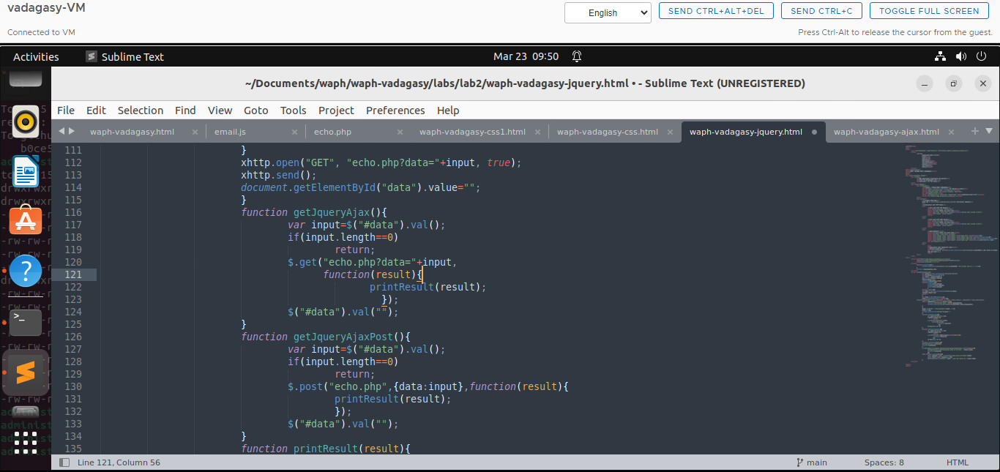

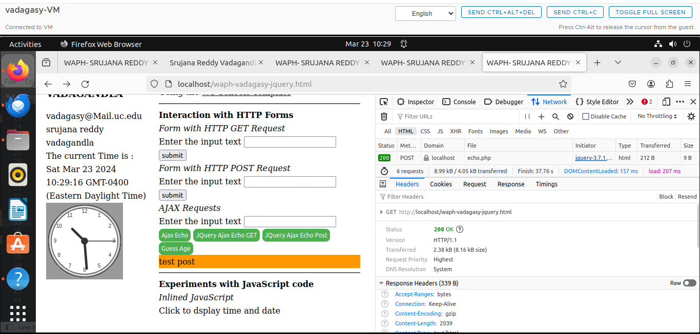

### d:  Web API integration
At last, I got to know that the integrated JavaScript Fetch API may be utilized in place of the outdated XMLHttpRequest (XHR). Instead of depending on callback functions for asynchronous activities, we may utilize the 'async' and 'await' keywords thanks to the Fetch API, which delivers a promise from the 'fetch()' method.

I fetched data using a few free APIs to put this into practice. In order to retrieve data from the API answers, I worked with JSON objects.

I get the daily joke about programming from the first API I tested. I utilized the free-source API's 'joke' JSON property to show the joke in the response.

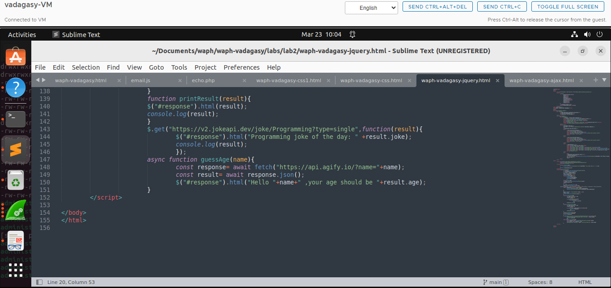

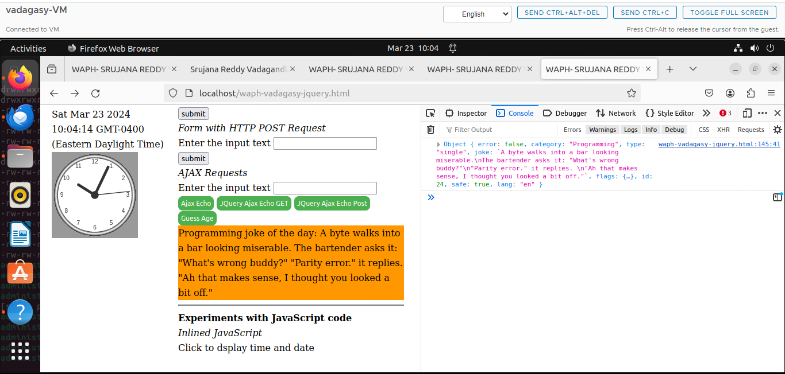

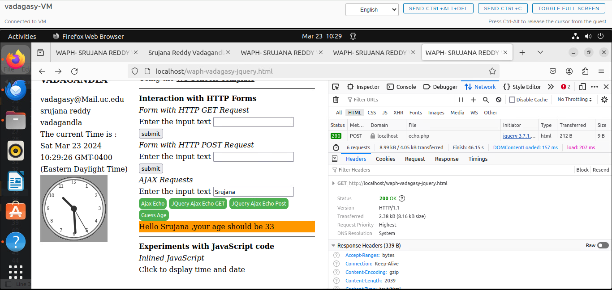

Inorder to know the age ,it is used in Second API.Which is done by taking name as the input , and the output for that is a random age of a person generated by the JSON object.

