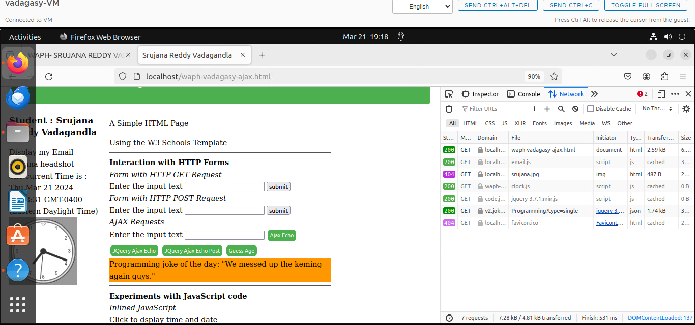
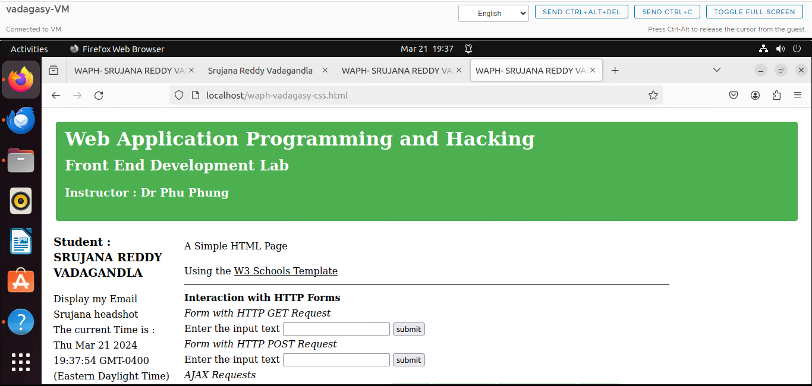
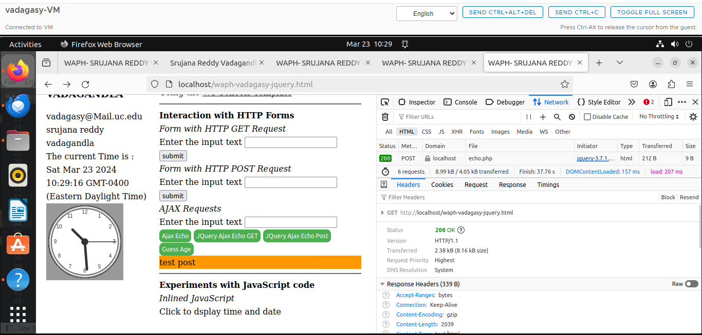

# WAPH-Web Application Programming and Hacking

## Instructor: Dr. Phu Phung

## Student

**Name**: Srujana Vadagandla

**Email**: vadagasy@mail.uc.edu

{width=150px height=150px}

# Lab 2 - Front-end Web Development

## Overview : 
This lab delves deeper into front-end web application development. In connection with Lab 2, I understood how to develop a web application using few basic HTML tags and javasrcipt by inlcuding images and forms and created a HTTP GET and POST request and further analyzed the the request, response, status code through the inspect element. After that Ajax , CSS and Jquery has been used to enhance the web application and make the code easy. . The pandoc tool was used to create the PDF file after all relevant screenshots had been taken and added, and the content had been prepared in markdown.

[https://github.com/challans216/waph-challans/blob/main/lab/lab2/README.md](https://github.com/challans216/waph-challans/blob/main/lab/lab2/README.md)

## Task 1 : Basic HTML with forms, and JavaScript

### a. HTML

As a part of this task i have created a lab2 folder in lab folder and created a simple HTML file with few basic tags.Here i have learned how to use the tags appropriately. I got familiarized with the insertion of link in html , images, and other content.Here form has also been introduced and HTTP GET and POST has been performed on the echo.php file which was already created during lab1 and the responses have been captured. Once the code has been done i used a command to copy the code to path /var/www/html to get the output on browser.

The ouptut has been captured on the browser as shown in the below screenshot.

### b. JavaScript
Following that, we discovered how to incorporate JavaScript code into our webpages.Through the use of an internal script tag in the HTML page, via inline javascript.- generating a file with the.js extension and use the script tag to reference it.- using HTTP to access external JavaScript files.

## Task II -  Ajax, CSS, jQuery, and Web API integration

### a: Ajax

After the JS and HTML i got familiarized with AJAX. Ajax is employed to retrieve data and send asynchronous requests to the server. To perform these calls, it uses the XMLHTTPRequest Object. The benefit is that we can dynamically change our website's content without having to reload the entire page.
For that we have used input function and button to send the GET request to echo.php file which was created as a part of Lab1 and the response has been captured through the inspect element.
Below are the screenshots of the output response which was made through Ajax request.

### b. CSS 

As a part of this section i tried to add styling to the webpage. Initially a demo was created with the usage of inline CSS by changing the background color. Then after the <style> element in head section was used to style the webpage. 

### c: JQuery

Learned about the jQuery library after that. This library can be used to choose HTML elements; it takes the place of functions like document.getElementById. This also serves as a convenient way to make ajax requests to the backend without having to create an instance of xmlhttprequest and write event handlers for it.
Created a jquery Get and post Request and the reponses have been captured in the below screenshot.

### d:  Web API integration
Lastly, the studied  is about the JavaScript built-in fetch API, which can be utilized in place of the xhr. The promise is returned by the retrieve() method. Thus, to create asynchronous behavior, we can use async await keywords in place of callback methods.
For this is to execute we have took some API's which are of free and tried to fetch the data. Json objects have been used to retrieve the data from the response of the API.

The first API displays the programming joke of the day which ia a free source api and the JSON object joke has been used to print the response.

The Second API is to get the age by taking name as input. An random age will be fetched based on the age Json oject.

