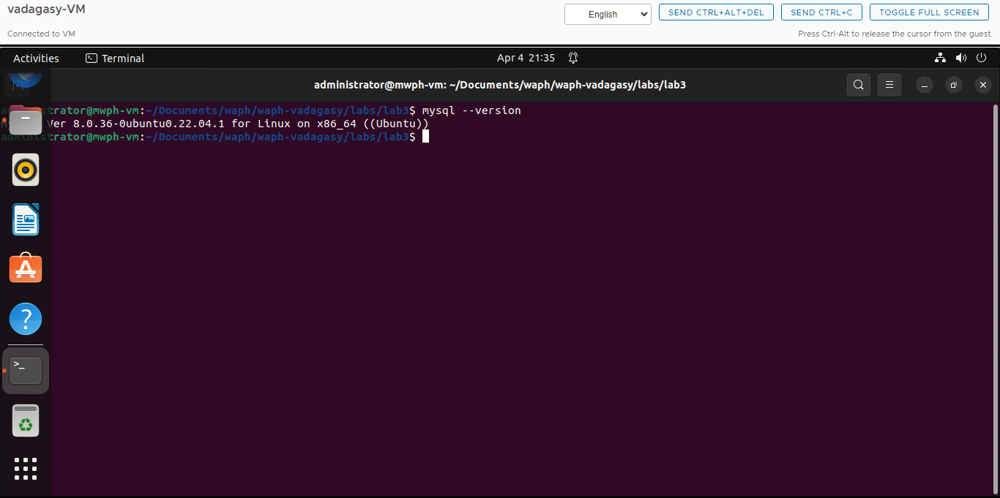
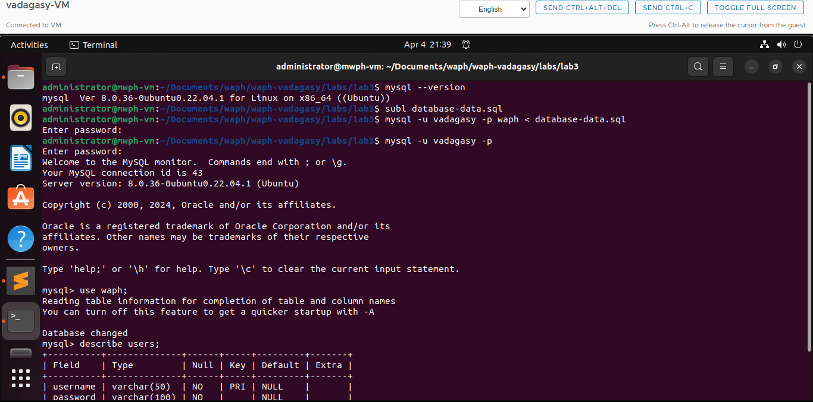
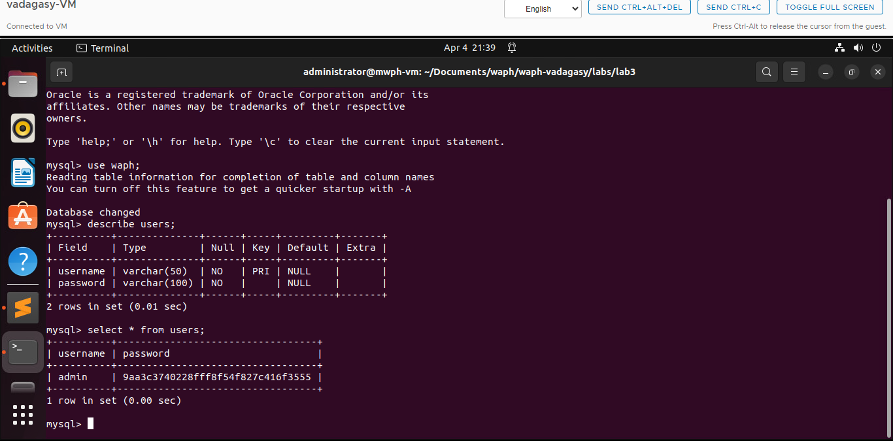
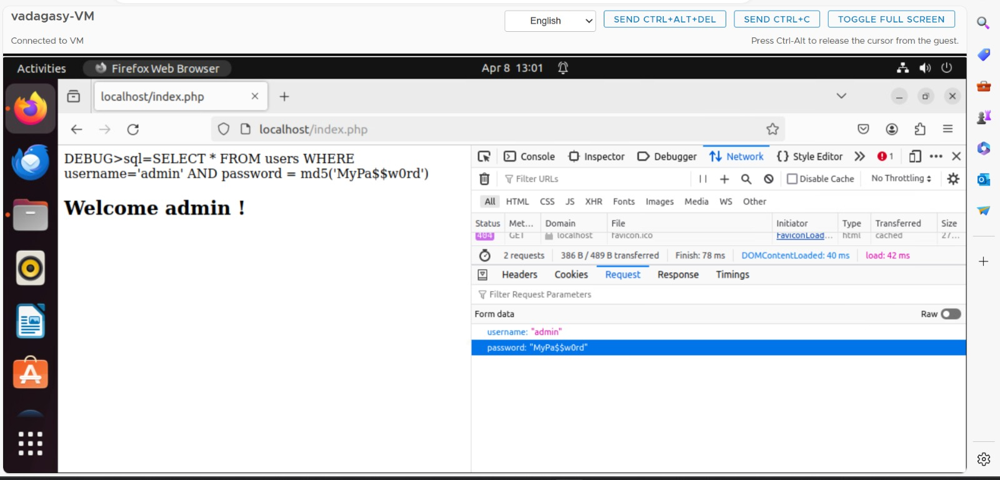
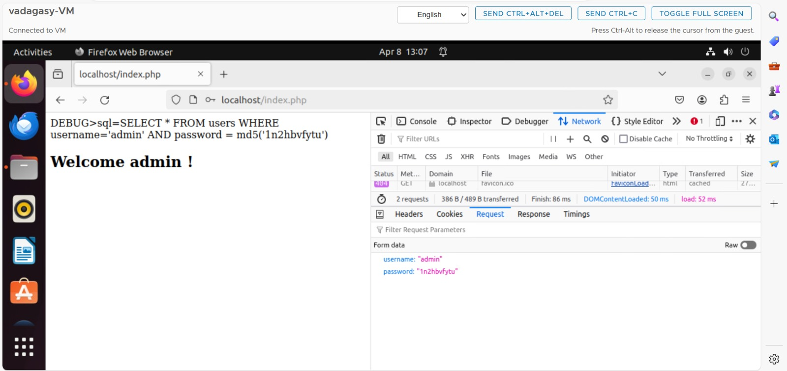
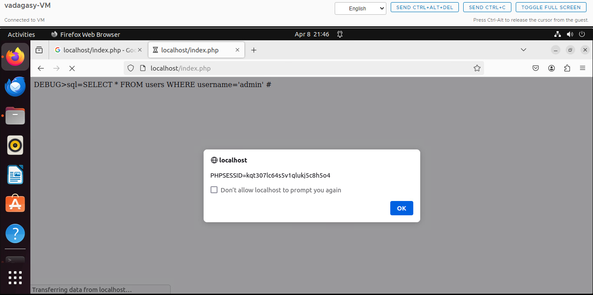
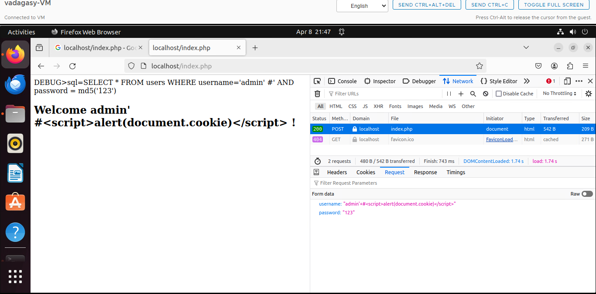
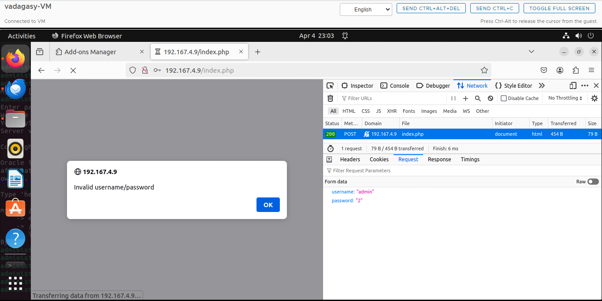
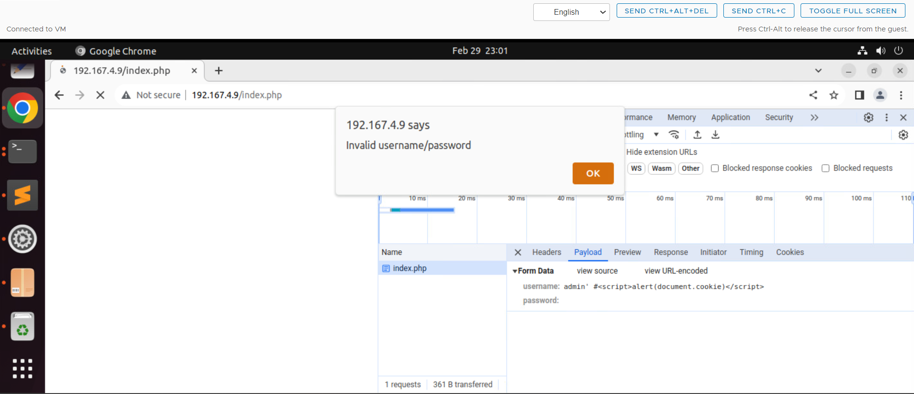

# WAPH-Web Application Programming and Hacking

## Instructor: Dr. Phu Phung

## Student

**Name**: Srujana Reddy

**Email**: vadagasy@mail.uc.edu

{width=150px height=150px}

# Lab 3 - Secure Web Application Development in PHP/MySQL

## Overview : 
In this lab, I explored in creating web applications with PHP and MySQL, extending the knowledge from Lab 3. My task wasto address and find security vulnerabilities in web development. I developed a web application and tested its security by performing SQL injection and XSS attacks to bypass the login system. To counter these vulnerabilities, I implemented input validation using prepared statements and sanitized the output. I documented each step, including the attack demonstrations, in a README file. For the final documentation, I used Pandoc to convert the markdown content and screenshots into a comprehensive PDF file.


[https://github.com/vadagasy/waph-vadagasy/blob/main/lab/lab3/README.md](https://github.com/vadagasy/waph-vadagasy/blob/main/lab/lab3/README.md)


## a. DataBase Setup and Management 
### MySQL installation

I checked for the Mysql Installation and Installed it and verfied it bu checking it's version.



### Create a New database, Database User and permission
For this task, I created a file named 'database-account.sql' it contains the SQL commands to create a new user and give permissions to this user.  I successfully created a new user in the database and was able to log in with that user's name and password I then committed and pushed these changes to GitHub, ensuring that the code and updates were properly versioned and stored in the repository.

```
create database waph;
	CREATE USER 'challans'@'localhost' IDENTIFIED BY 'candy@16';
	GRANT ALL ON waph.* TO 'challans'@'localhost';
```

### Create a new table Users and insert data into the table 
I created a table 'users' in the database, which includes fields for the user's name and password. next, I inserted a record with a randomly chosen username and password.  I used an SQL SELECT query inorder to check it. The retrieved data, as shown in the screenshot, indicates that the password is stored in a hashed format for security.

```
drop table if exists users;
create table users(
	username varchar(50) PRIMARY KEY,
	password varchar(100) NOT NULL);
INSERT INTO users(username,password) VALUES ('admin',md5('MyPa$$w0rd'));
```






## b. A Simple (Insecure) Login System with PHP/MySQL
To work with database programming, I installed the PHP-MySQLi extension, which enables PHP to interact with MySQL databases. Then, I created a form that serves as a login page, which collects username and password. Next, I created an `index.php` file that contains a `checklogin` function. This function is tasked with verifying the login details submitted through the form, checking them against the database to authenticate users.

```
index.php
<?php
	session_start();    
	if (checklogin_mysql($_POST["username"],$_POST["password"])) {
?>
	<h2> Welcome <?php echo $_POST['username']; ?> !</h2>
<?php		
	}else{
	echo "<script>alert('Invalid username/password');window.location=
	'form.php';</script>";
		die();
	}
	unction checklogin_mysql($username, $password) {
		$mysqli = new mysqli('localhost','challans' /*DB username*/,'candy@16'
		/*DB password*/,'waph' /*DB name*/);
				if ($mysqli->connect_errno){
					printf("Datebase connection failed: %s\n",
					$mysql->connect_error);
					exit();
		}
?>
```

```
form.php

<form action="index.php" method="POST" class="form login">
    Username:<input type="text" class="text_field" name="username" /> <br>
    Password: <input type="password" class="text_field" name="password" /> <br>
    <button class="button" type="submit">Login</button>
  </form>
```



## c. Performing XSS and SQL Injection Attacks

### Sql injection attacks

These attacks, such as SQL injection, occur primarily because of unverified or correct input validation. Without thorough checking, attackers can take advantage of this by inserting harmful SQL code into the query inputs. The risk is especially high when applications use plain SQL queries that directly concatenate with user inputs, creating a pathway for such attacks. Ensuring security is a critical aspect of application development, and the absence of proactive security measures can significantly increase the vulnerability to SQL injection attacks.




### Cross-site Scripting(XSS)
 






## d.Prepared Statement Implementation

### Prepared Statement for SQL Injection Prevention
I utilized prepared statements to sanitize the output and avoid vulnerabilities with SQL injection attacks.
The code below has been used to prevent SQL injection attacks.


code:
```
$prepared_sql = "SELECT * FROM users WHERE username= ? " . " AND password=md5(?);";
		$stmt = $mysqli->prepare($prepared_sql);
		$stmt->bind_param("ss", $username,$password);
		$stmt->execute();
		$result=$stmt->get_result();
```

Invalid login with implementation of Prepared statement	

	
Logged in succesfully  with the implementation of prepared statements after providing correct credentials.

### Security Analysis
Explaination of Prepared Statements: 
The prepared statements employ parametrized queries, which keep user input and SQL code apart. 
The escaping notion will also be used to user input in prepared sentences.Given that various escape concepts need changing the special characters that users enter.
 
Implement Sanitization : 
This line <h2> Welcome \?php echo $_POST["username"];?> besides the SQLi vulnerability</h2> since the input variable is shown immediately in index.php, making it susceptible to XSS attacks. In order to get around this, I've utilized htmlspecialchars, which translate the special characters into the appropriate HTML entities so that they're seen as plain text rather than HTML tags.


```
<h2> Welcome <?php echo $_POST["username"]; ?> !</h2>

```


Discussions

what if the username/password are empty?
The code does not check to see if the username and password fields in the checklogin_mysql() method are empty before attempting to utilize them. In the event that the user submits the form without entering any information, this might lead to unanticipated consequences or errors.

what if there are any database errors?
Even while the code includes error handling for unsuccessful database connections ($mysqli->connect_error), it does not handle other possible database failures that may occur during query execution. For example, when there is a syntax mistake in the SQL query or when the database server is having issues, the code fails quietly and doesn't alert the user.


what if the provided username is not exactly the same as the username from the database.?
Because MD5 hashes quickly and doesn't need salting, it is seen as risky when used to store passwords. It is also susceptible to brute-force and rainbow table attacks. It is advised to use more secure hashing algorithms, such as Argon2 or bcrypt, to increase security. These techniques each need a different salt for each password. Case sensitivity in username authentication is highlighted by the existing system, which obtains user records from the database only if the supplied and stored usernames and passwords exactly match. If there is a difference in case between the username that the user entered and the one that is kept in the database, this might cause problems.
