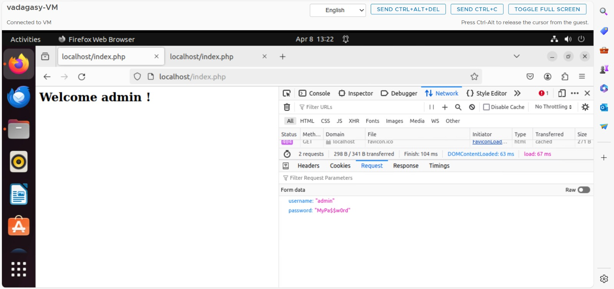

# WAPH-Web Application Programming and Hacking

## Instructor: Dr. Phu Phung

## Student

**Name**: Nirosha Challa

**Email**: challans@mail.uc.edu

{width=150px height=150px}

# Lab 3 - Secure Web Application Development in PHP/MySQL

## Overview : 
This lab delves deeper into  creation of front-end web application Using PHP and MySQL. In connection with Lab 3, I understood how to analyse the vulnerabilities that are present while developing a web application and the the procedures to mitigate them. As a part of first task we developed a web application where i have performed sql injection and XSS attacks to login the system. Then after inorder to mitigate these kind of issues we tried to do input validation with the usage of prepared statements and do output sanitization. All these have been recorded in README file along with the screenshots of the attacks. The pandoc tool was used to create the PDF file after all relevant screenshots had been taken and added, and the content had been prepared in markdown.


[https://github.com/challans216/waph-challans/blob/main/lab/lab3/README.md](https://github.com/challans216/waph-challans/blob/main/lab/lab3/README.md)


## a. DataBase Setup and Management 
### MySQL installation

As a part of this task i have installed the mysql server as a part of instructions. After that i have checked whether i have installed it and connected with root user.


### Create a New database, Database User and permission
As a part of this task i have created a file database-acccount.sql and provided the code to create a user name and to provide permissions for the user.With the execution of the file new user has been created and i was able to login successfully.The code has been successfully commited and pushed into github.

```
create database waph;
	CREATE USER 'challans'@'localhost' IDENTIFIED BY 'candy@16';
	GRANT ALL ON waph.* TO 'challans'@'localhost';
```

### Create a new table Users and insert data into the table 
Here i have created a table users which consists of a user name and password fields.Then after i inserted a record into the table with the random username and password.With the SQL SELECT query i have retrived the data. As we can see in the below screenshot the password has been a hashed.In the first line it has been written to drop the table if its already exists in the database.

```
drop table if exists users;
create table users(
	username varchar(50) PRIMARY KEY,
	password varchar(100) NOT NULL);
INSERT INTO users(username,password) VALUES ('admin',md5('MyPa$$w0rd'));
```


## b. A Simple (Insecure) Login System with PHP/MySQL
Here inorder to work on the database programming i have installed php-mysqli web driver and created a form and index.php. Form consists of details related to login page . Index.php consists of a checklogin function which is used to check the login details.

```
index.php
<?php
	session_start();    
	if (checklogin_mysql($_POST["username"],$_POST["password"])) {
?>
	<h2> Welcome <?php echo $_POST['username']; ?> !</h2>
<?php		
	}else{
	echo "<script>alert('Invalid username/password');window.location=
	'form.php';</script>";
		die();
	}
	unction checklogin_mysql($username, $password) {
		$mysqli = new mysqli('localhost','challans' /*DB username*/,'candy@16'
		/*DB password*/,'waph' /*DB name*/);
				if ($mysqli->connect_errno){
					printf("Datebase connection failed: %s\n",
					$mysql->connect_error);
					exit();
		}
?>
```

```
form.php

<form action="index.php" method="POST" class="form login">
    Username:<input type="text" class="text_field" name="username" /> <br>
    Password: <input type="password" class="text_field" name="password" /> <br>
    <button class="button" type="submit">Login</button>
  </form>
```


## c. Performing XSS and SQL Injection Attacks

### Sql injection attacks

 These type of attcaks happen due to lack of input validation , when the input is not properly validated attackers can exploit this by injecting 
 SQL code into the input query.
 It there is a usage of plain sql queries which will concatenate with the user input can lead to this attack.
 Security is most important while developing the application if there are no active measures taken properly can also lead to SQL injection attacks.


### Cross-site Scripting(XSS)
 


## d.Prepared Statement Implementation

### Prepared Statement for SQL Injection Prevention
Here i have used the prepared statements inorder to sanitize the output to avoid vulnerabities with the sql inject attacks
the below code has been utilized to avoid the sql injection attacks.

code:
```
$prepared_sql = "SELECT * FROM users WHERE username= ? " . " AND password=md5(?);";
		$stmt = $mysqli->prepare($prepared_sql);
		$stmt->bind_param("ss", $username,$password);
		$stmt->execute();
		$result=$stmt->get_result();
```

Invalid login with implementation of Prepared statement	

	
Logged in succesfully  with the implementation of prepared statements after providing correct credentials.

### Security Analysis
Prepared Statement Explanation:
 Since the prepared statements use the parametrized queries where the sql code  and user input are kept separate. 
 Prepared statements will also use escaping concept for the user input.Since these escaping concept involves modifying the special characters in 
 user input.
 They can also provide protection irrespective of the data type.


Implement Sanitization : 
Apart from the SQLi vulnerability, this line <h2> Welcome <?php echo $_POST["username"]; ?> !</h2> in index.php is vulnerable for XSS attack as the input varible is diplayed directly. To overcome this I have used htmlspecialchars which convert the specical characters to their corresponding HTML entities, ensuring that they are treated as plain text and not interpreted as HTML tags.
```
<h2> Welcome <?php echo $_POST["username"]; ?> !</h2>

```


Discussions

what if the username/password are empty?
Before attempting to use the username and password fields in the checklogin_mysql() function, the code does not verify to see if they are empty. This could result in unexpected actions or mistakes if the user sends the form with no information entered.

what if there are any database errors?
The code does not handle other possible database failures that can arise during query execution, even if it does include error handling for failed database connections ($mysqli->connect_error). For instance, the code fails silently and does not notify the user if there is a syntax error in the SQL query or if there is a problem with the database server.

what if the provided username is not exactly the same as the username from the database.?
It is deemed insecure to save passwords using the MD5 hash without salting them. Fast hashing method MD5 is susceptible to rainbow table and brute-force attacks. To improve security, it is advised to use more powerful hashing algorithms, such as bcrypt or Argon2, with a different salt for every password. When the username and password precisely match the input entered, the code fetches user records from the database. This indicates that usernames are case-sensitive, which may cause problems with authentication if the user's username and the one that the database stores are different.
