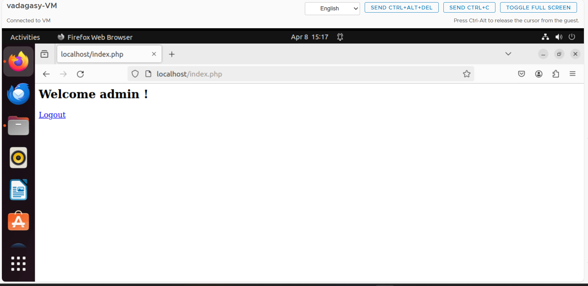
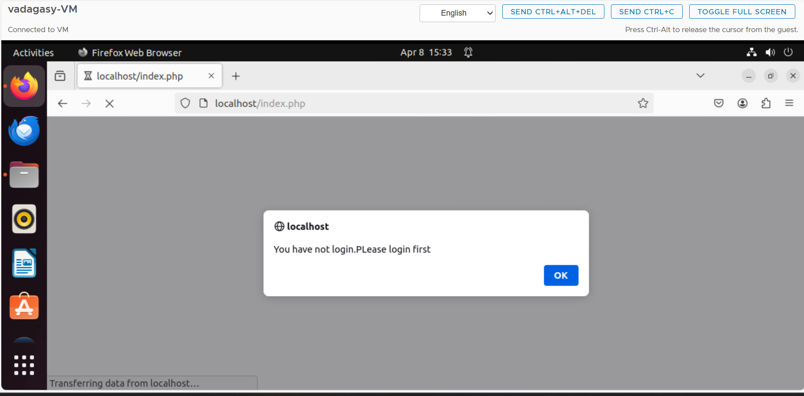

# WAPH-Web Application Programming and Hacking

## Instructor: Dr. Phu Phung

## Student

**Name**: Srujana Vadagandla

**Email**: vadagasy@mail.uc.edu

# Lab 4 - A Secure login System with Session Authentication

## Overview : 
This lab gave me knowledge. Understanding session management for PHP web application testing and deployment. I saw the post-test session using Wireshark. identifying session-jacking. In part two, I learned about the security of the session, session authentication, and authentication in Unsecured Session Part 3. Together with screenshots of the attacks, all of these have been documented in the README file. After all pertinent screenshots were captured and included, and the material was produced in markdown, the pandoc tool was used to build the PDF file.

[https://github.com/vadagasy/waph-vadagasy/blob/main/lab/lab4/README.md](https://github.com/vadagasy/waph-vadagasy/blob/main/lab/lab4/README.md)

## Task 1 : Understanding Session Management in a PHP Web Application

### 1.a. Deploy and test

To check the sessions, a file called session.php is written, deployed to the web server, and visited using a browser.

 
session page in a different browser

### 1.b Observe the Session-Handshaking using Wireshark
The browser's session handshaking is observed using Wireshark following the deployment of the sessiontest.

Discussion:A number of stages were engaged in the handshaking procedure. It is noticeable that the cookie is not set in the first request and that it is set in the following response that follows the request.

### 1.c Understanding Session Hijacking
Using PHPSESSID, which is obtained through document.cookie as a hack, the session is taken over.

## TASK 2 : Insecure Session Authentication
###  2. a. Revised Login System with Session Management
Index.php is used to create a session, which generates a login mechanism.

### 2. b. Session Hijacking Attacks

## TASK 3 : Securing Session and Session Authentication
###  3. a. Data Protection and HTTPS Setup

 ### 3. b. Securing Session Against Session Hijacking Attacks- setting HttpOnly and Secure flags for cookies

### 3. c. Securing Session Against Session Hijacking Attacks- Defense In-Depth

 
